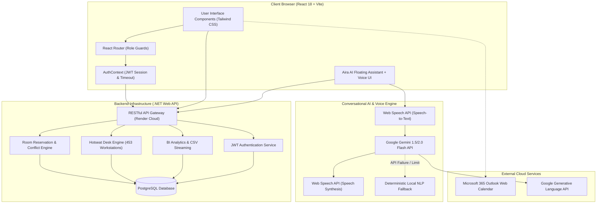
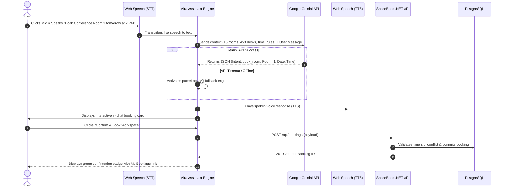
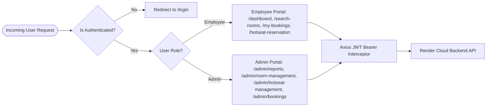

# 📐 SpaceBook System Architecture

This document details the architectural design, component layers, conversational AI pipeline, and security models of **SpaceBook**.

---

## 1. High-Level System Architecture

---

## 2. Conversational AI & Voice Flow

---

## 3. Security & Access Control Architecture

---

## 4. Resilience & Hybrid Fallback Model

To ensure zero downtime:
1. **Network / Offline Resilience**: If Google Gemini API key is missing or rate limited, the deterministic local NLP engine (`parseLocally`) seamlessly parses queries and generates booking cards without throwing errors.
2. **Master Inventory Resilience**: If the backend database is unseeded or missing room records, `DEFAULT_INITIAL_ROOMS` in `RoomManagement.jsx` ensures all 15 campus rooms remain accessible.
3. **Storage Synchronization**: Custom meeting titles created in the conversational bot are cached in `localStorage` (`spacebook_meeting_titles`) to guarantee continuity across page reloads.
